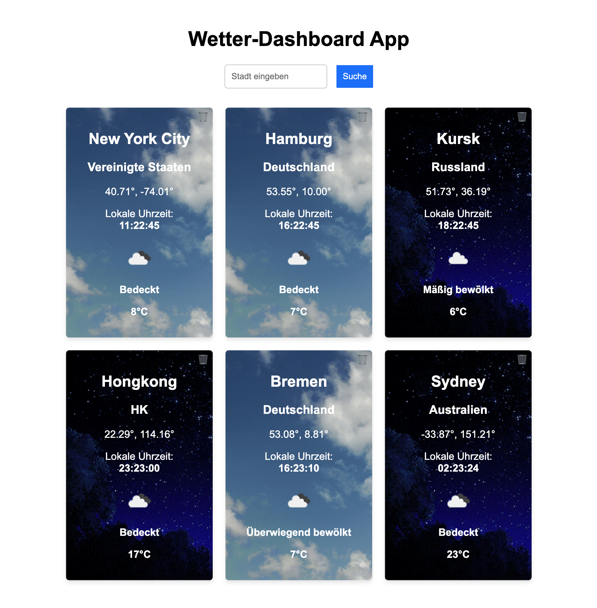

# weather-fetch

kleines Projekt für DCI mit einem Datenbank Fetch von 
https://openweathermap.org/api

## Projektbeschreibung

Dieses Projekt `weather-fetch` ist ein kleines Tool, das Wetterdaten von der OpenWeatherMap API abruft und in einer Datenbank speichert. Es wurde im Rahmen eines DCI-Kurses entwickelt und demonstriert grundlegende Fähigkeiten im Umgang mit APIs und Datenbanken.

### Features

- Abrufen von aktuellen Wetterdaten für verschiedene Städte
- Speichern der Wetterdaten in einer lokalen Datenbank
- Einfache Abfrage der gespeicherten Wetterdaten
